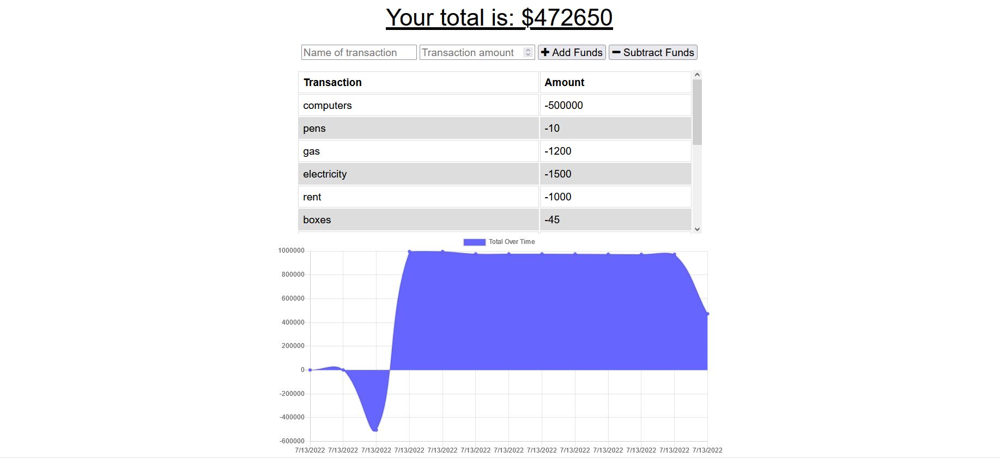

# Budget Tracker Starter Code
## <ins>Description</ins>
Budget tracker is a Progrogressive web app that allows you to continue to track yand monitor your budget, even when you have no internet!  The app utilizes Node.js, MongoDB Atlas, Mongoose and IndexedDB.

[Git Hub](https://github.com/KaylaVangel/PWA)